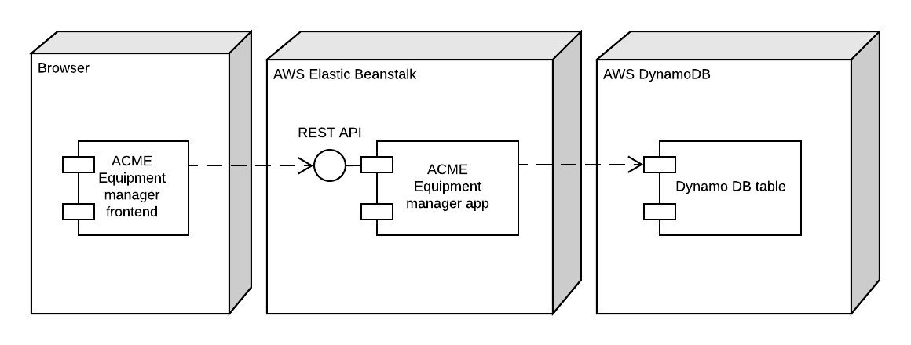
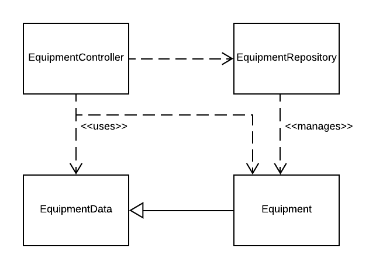

# Running and deploying

The application is written in Java and dependencies are managed using Maven.

The application needs AWS environment with DynamoDB configured.

## Docker

Prerequisites: Docker

1. `docker build -t acme .`
2. `docker run -p 8080:8080 acme`

## Maven

Prerequisites: Java (>= 11) and Maven.

1. `mvn package`
2. `java -jar target/equipmentmanager-1.0.0.jar`

## IDE

Prerequisites: IntelliJ IDEA or other IDE, Java, Maven.

1. Run `com.acme.Application`

# System architecture

The system composes of ACME Equipment manager backend application, the frontend application and AWS Dynamo DB database.

The application servers the static files of frontend application, exposes the REST API to manage the equipment and interacts with the database to persist the data.

## Discussion

Not much decisions went into designing the system itself. The client-server-database -architecture was more or less dicatated by the requirements. The DynamoDB was selected as the NoSQL database based on some previous experiences with it although it could be argued that it is not best suited for this kind of workload.

# Application architecture

The backend application is implemented using Java and [Micronaut framework](https://micronaut.io). The application logic is written using the [reactive programming](https://en.wikipedia.org/wiki/Reactive_programming) concepts (RxJava).

The application is composed using the following structure:

- `com.acme.model`: The full model object POJOs that are persisted in the database.
- `com.acme.model.data`: Partial model object POJO DTOs that are used in the REST API when manipulating data.
- `com.acme.controller`: The HTTP controllers implementing the REST API. Logic related to the REST API and HTTP layer should only be here (though it leaks a bit to the model because of the annotation based validation).
- `com.acme.repository`: The DAO layer for persisinting the data and accessing the database. The logic related to the DynamoDB should only be found from here.

## Discussion

I have for while wanted try out the Micronaut framework and this exercise provided a good possibility to do that. Micronaut is created by [Graeme Rocher](https://twitter.com/graemerocher) who has long history with JVM web frameworks. I've previously used [Grails](https://grails.org) also created by him and the promises that the Micronaut makes e.g. about performance were quite promising.

Although I only scratched the surface of the framework with this exercise it seemed that its _convention over configuration_ choices mapped well with my expectations.

This was my first time using reactive programming pattern implementing REST APIs. Although it would be best fit for more stream-like data it was also fit to to implement basic CRUD operations.

# Hosting

The application is hosted in AWS Elastic Beanstalk using the Docker to containerize the application.

## Discussion

I chose AWS Elastic Beanstalk because I had quite negative experiences with that in the past. The deploys using raw Node.js application were unreliable and slow. This time I decided to Docker and at least with the few deploys I did implementing the demo everything worked flawlessly.

# API Design

API is designed following the principles of [RESTFul APIs](https://en.wikipedia.org/wiki/Representational_state_transfer).

Endpoints are created for resource _Equipment_ using the standard HTTP verbs `GET`, `POST` and `DELETE` to list equipment, get single equipment and to create equipment. I also implemented two extra endpoints to clear up the database and generate test data for the purposes of this demo.

The API is documented using [OpenAPI 3.0](https://swagger.io/specification/) specification. The API specification is served from URL `/swagger/swagger.yml`.

## Discussion

Over the time I've used both _Implementation first_ and _Specification first_ approaches to create API documentation/specification. Of course I have also have implemented systems where both implementation and API documentation are done manually but I quite strongly feel that that always ultimately leads to situation of API implementation and documentation being out of sync with each other.

This time I chose the _Implementation first_ approach of first creating the Java controller and model classes and generating OpenAPI 3.0 documentation from those. Although it technically works there are inconsistencies at least in the chosen library whether it reads the documentation from the JavaDoc (controllers) or from the `@Schema` annotation only (models). There are also nuisances like if you would also like the document the error scenarios like `400 Bad request` errors it would break the auto-generation of happy path request documentation.

After this experiment I am more convinced that in the most scenarios the better way is to write the _Specification first_ and generate API implementation skeletons and request validation based on that. This way the documentation that is meant for humans is written by humans. The implementation parts generated are usually so general and high level that they are perfectly usable and extendable.

# Frontend application

The frontend application is only meant to show the functionality of the API in an simplified manner.

The frontend is implemented using pure HTML, CSS and JavaScript. It uses some of the modern browser APIs (like `fetch`) so it is not guaranteed to work on all browsers.

## Discussion

It would probably normally create this kind of applications using React but given that the requirements for the application were non-existing I opted-in to write the frontend application without any external dependencies.
